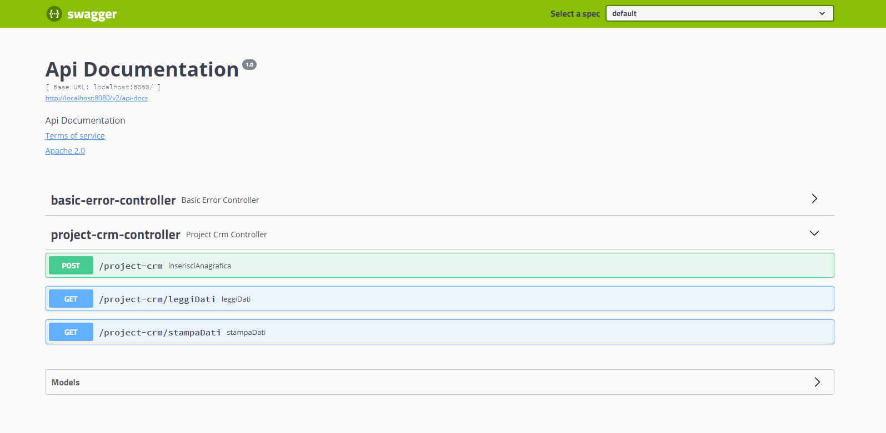

# Project_Crm

Questo progetto contiene 1 metodo `POST` e 2 metodi `GET`. Il metodo `POST` permette di scrivere l'anagrafica sul DB e su un file di testo chimato Project_Crm, i metodi `GET` permettono di leggere i dati inseriti con il `POST` o dal DB o dal file di testo

Per inserire i file sul DB ho creato un nuovo DB chiamato project_crm, dove al suo interno ho creato la tabella anagrafica con le colonne: id, nome, cognome e telefono

Per creare la tabella ho usato la script SQL:

```sql
CREATE TABLE anagrafica (
    id int NOT NULL AUTO_INCREMENT,
    nome varchar(255) NOT NULL,
    cognome varchar(255) NOT NULL,
    telefono varchar(255) NOT NULL,
    PRIMARY KEY (id)
);
```

Per il telefono ho usato il varchar per poter permettere all'utente di inserire il prefisso internazionale con il "+" prima dei numeri

Il file di testo si può trovare nella cartella del progetto con il nome Project_Crm.txt

Si possono utilizzare gli endpoint scrivendo `http://localhost:8080/swagger-ui.html`, oppure direttamente da qui cliccando su http://localhost:8080/swagger-ui.html

E' necessario startare il DB usando ad esempio XAMPP per poter utilizzare il `POST` per inserire i dati sul DB e il `GET` per leggere i dati dal DB, invece non è necessario startare il DB se si vuole utilizzare il `GET` per stampare i dati dal file di testo 

Ecco un esempio di quello che viene visualizzato sullo swagger:


