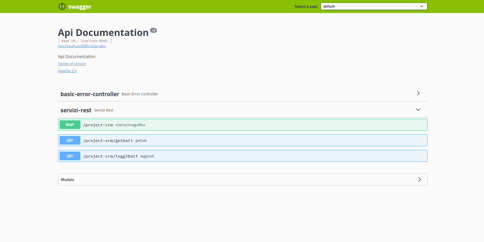

# Project_Crm

Questo progetto è costituito da 4 classi. Nella classe `DataBase` troviamo la connessione al `DB`, nella classe `MetodiDB` è possibile torvare tutti i metodi che interagiscono con il `DB`, nella classe `AnagraficaBean` troviamo i `set` e i `get` dei dati ed infine nella classe `ServiziRest` troviamo 1 servizio di tipo `post` e due servizi di tipo `get`

Il servizio di tipo `post` permette di inserire i dati immessi sul DB e dentro un file di testo chiamato `Project_Crm`, i servizi di tipo `get` invece permettono di visualizzare i dati presenti o dal DB o dal file di testo

Per inserire i file sul DB ho creato un nuovo DB chiamato `project_crm`, dove al suo interno ho creato la tabella `anagrafica` con le colonne: id, nome, cognome e telefono

Per creare la tabella ho usato lo script SQL:

```sql
CREATE TABLE anagrafica (
    id int NOT NULL AUTO_INCREMENT,
    nome varchar(50) NOT NULL,
    cognome varchar(50) NOT NULL,
    telefono varchar(20) NOT NULL,
    PRIMARY KEY (id)
);
```

Per il telefono ho usato il varchar per poter permettere all'utente di inserire il prefisso internazionale con il "+" prima dei numeri

Il file di testo si può trovare nella cartella del progetto con il nome Project_Crm.txt

Si possono utilizzare gli endpoint scrivendo `http://localhost:8080/swagger-ui.html`, oppure direttamente da qui cliccando su http://localhost:8080/swagger-ui.html

Ecco un esempio di quello che viene visualizzato sullo swagger:


